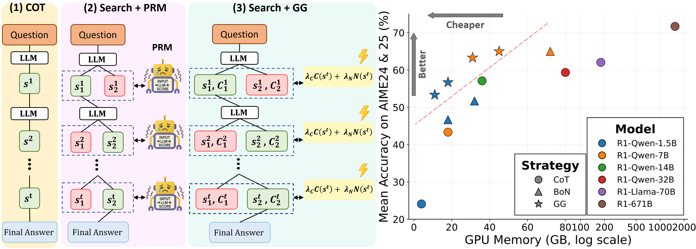

<p align="center">
  
</p>

---


# Guided by Gut: Efficient Test-Time Scaling with Reinforced Intrinsic Confidence [📄 Paper Link](https://arxiv.org/abs/2505.20325)

**Guided by Gut (GG)** is an efficient Test-Time Scaling (TTS) framework that
combines

1. **Reinforcement-learning fine-tuning** (confidence-based GRPO) implemented in  
   `openr1/`, and
2. **Self-guided Tree Search** implemented in  
   `Search/`

---
<p align="center">
  
</p>


## Repository layout

```

GG
├── openr1/                # RL fine-tuning (modified Open-R1 fork)
│   ├── src/
│   │   ├── openr1/        # Core OpenR1 code (lightly patched)
│   │   │   └── rewards.py  # ➜ confidence_based_reward()
│   │   └── trl0.16/
│   │       └── grpo_trainer.py   # ➜ custom GRPO trainer
│   ├── merge_lora.py       # Utility to merge LoRA weights
│   └── ...                 # recipes/, accelerate configs, YAMLs
└── Search/
        ├── src/
        │   └── sal/search/diverse_verifier_tree_search_GG.py
        └── recipes/ # YAML configs for search hyper-params for different configurations

````

---

## 1. Quick-start checklist

| Step | What you do | Where |
|------|-------------|-------|
| 1️⃣  | Install deps (make sure **TRL 0.16.0**) | root |
| 2️⃣  | Copy custom `grpo_trainer.py` over TRL’s grpo_trainer | root → `site-packages/trl/...` |
| 3️⃣  | Fine-tune with GRPO + confidence reward | `open-r1/` |
| 4️⃣  | Merge LoRA weights into the base ckpt | `open-r1/merge_lora.py` |
| 5️⃣  | Run GG search via DVTS recipes | `Search/` |
| 6️⃣  | Evaluate & score results | `Search/` (`eval.py`) |

---

## 2. Requirements

Make sure your environment satisfies the software and hardware prerequisites listed in **`GG/openr1/README.md`**.
That document covers CUDA, Python, and all Python-package versions (notably **`trl == 0.16.0`**) needed for confidence-based GRPO training.

---

## 3. Patching TRL

After installing **TRL 0.16.0**, overwrite its default *GRPO trainer* with the customised file at
`GG/open-r1/src/trl0.16/grpo_trainer.py`.

> **Manual step**
> Copy the file above to `site-packages/trl/trainer/grpo_trainer.py`, replacing the original.
> Re-apply this patch any time you upgrade or reinstall TRL.

---


## 4. Training (confidence-RL fine-tuning)

```bash
# From the repository root …
cd openr1                     # <-- step 1

# Two A100 80 GB cards; adjust CUDA_VISIBLE_DEVICES as needed
CUDA_VISIBLE_DEVICES=0,1 \
ACCELERATE_LOG_LEVEL=info \
accelerate launch \
  --config_file recipes/accelerate_configs/zero2.yaml \
  --num_processes 1 \
  src/open_r1/grpo.py \
  --config recipes/DeepSeek-R1-Distill-Qwen-1.5B/grpo/LIMO_ConfReward.yaml
```

Key points

* `grpo.py` is patched to perform **PEFT (LoRA)** instead of full fine-tuning.
* Reward is **confidence\_based\_reward** (`open_r1/rewards.py`).
* Logs & checkpoints land under `outputs/` (path configurable in YAML).

---

## 5. Merging LoRA weights

After training, bake the LoRA deltas into a standalone HF model:

```bash
python open-r1/merge_lora.py \
  --base_model deepseek-ai/DeepSeek-R1-Distill-Qwen-1.5B \
  --lora_path  open-r1/outputs/ckpt-lora \
  --output_dir open-r1/outputs/merged-gg-1p5B
```

Edit paths inside `merge_lora.py` or supply CLI args, then upload to the Hub if desired.

---
## 6. Available Models

We provide the following models fine-tuned using the "Guided by Gut" (GG) methodology with a **Confidence-Based Reward** via **Group Relative Policy Optimization (GRPO)** on the **LIMO dataset**:

1.  **`AmirhoseinGH/DS-Qwen-1.5b-GG-CalibratedConfRL`**
    * **Base Model:** DeepSeek-R1 Qwen Distill 1.5B
    * **Description:** This model was fine-tuned to enhance its intrinsic confidence calibration, making it highly effective with the Guided-by-Gut search strategy.
    * **Link:** [DS-Qwen-1.5b-GG-CalibratedConfRL](https://huggingface.co/AmirhoseinGH/DS-Qwen-1.5b-GG-CalibratedConfRL)

2.  **`AmirhoseinGH/DS-Qwen-7b-GG-CalibratedConfRL`**
    * **Base Model:** DeepSeek-R1 Qwen Distill 7B
    * **Description:** Similar to its 1.5B counterpart, this 7B parameter model has undergone confidence calibration fine-tuning.
    * **Link:** [DS-Qwen-7b-GG-CalibratedConfRL](https://huggingface.co/AmirhoseinGH/DS-Qwen-7b-GG-CalibratedConfRL)

To use these models with the search strategies below, set the `model_path` in your YAML configuration file to the respective Hugging Face identifier (e.g., `AmirhoseinGH/DS-Qwen-1.5b-GG-CalibratedConfRL`).


## 7. Guided-by-Gut search (inference)

### 7.1 Installation instructions

To run the the test time scaloing code, first, create a Python virtual environment using e.g. Conda:

```shell
conda create -n sal python=3.11 && conda activate sal
```

```shell
cd Search
pip install -e '.[dev]'
```

Next, log into your Hugging Face account as follows:

```shell
huggingface-cli login
```

Finally, install Git LFS so that you can push models to the Hugging Face Hub:

```shell
sudo apt-get install git-lfs
```

You can now check out the `scripts` and `recipes` directories for instructions on how to scale test-time compute for open models!

### 7.2  Pick / tweak a recipe

All YAMLs live in `Search/recipes/`.
Example (GG, DVTS, **N = 32**, AIME 2024):

```
GG/Search/recipes/R1_Distll_Qwen1.5B-7B/GG/\
R1-1p5B__n32__aime_2024/\
config_approach_dvts4--dataset_name_HuggingFaceH4aime_2024--dataset_split_train--model_name__R1-1p5B--n_32--seed_10--temperature_0_6--temperature0_1_0.yaml
```
To Run Search with a specific setting, use the following command:
```shell
export CONFIG=recipes/path_to_option_file.yaml

python scripts/test_time_compute.py $CONFIG
```
---

### 📑 YAML field reference

| Key | Type | Meaning / Allowed values |
|-----|------|--------------------------|
| **approach** | `str` | Which search algorithm to run. Use `dvts4` for Guided-by-Gut and `dvts` for normal DVTS search with PRM; `best_of_n`, `cot`, etc. for baselines. |
| **use_prm** | `bool` | `false` → use GG’s intrinsic confidence + novelty.<br>`true`  → score with an external PRM (give its HF path in `prm_path`). |
| **system_prompt** | `str` | system prompt. |
| **temperature0** | `float` | LLM temperature for the *first* 10 expansion steps (higher → more diverse roots). |
| **temperature** | `float` | Temperature after step 10. |
| **max_tokens** | `int` | Hard cap on tokens generated *per path*. |
| **n** | `int` | Compute budget—target *number of final paths* kept. |
| **beam_width** | `int` | Parallel beams explored at each tree depth. |
| **min_step_tokens** | `int` | minimum length of a reasoning step. |
| **num_iterations** | `int` | Maximum search steps (tree expansions). |
| **novelty_bonus** | `float` | Weight of the novelty score in GG’s intrinsic reward. |
| **model_path** | `str` | HF identifier or local path of the base model. |
| **search_batch_size** | `int` | How many partial paths to expand per forward pass. |


**Quick switch-over guide**  
> • **GG intrinsic signals** &nbsp;`approach: dvts4` &nbsp;+&nbsp; `use_prm: false` (default)  
> • **PRM-guided search** &nbsp;`use_prm: true` **and** set `prm_path:` to one of  
>   `RLHFlow/Llama3.1-8B-PRM-Deepseek-Data`,  
>   `peiyi9979/math-shepherd-mistral-7b-prm`,  
>   `Skywork/Skywork-o1-Open-PRM-Qwen-2.5-1.5B`, or  
>   `Skywork/Skywork-o1-Open-PRM-Qwen-2.5-7B`.

---


## 8. Evaluation

* **AIME / AMC**

  Before running the script, **open `Search/src/sal/search/eval.py` and set the
  `COMPLETIONS_PATH` (or equivalent variable) to the location of your
  JSONL file**:

  ```bash
  #   INPUT_FILE = "results/R1-1p5B/aime24/seed0/dvts_n32.jsonl"
  python Search/src/sal/search/eval.py
  ```


* **MATH-500**
    To get the final numbers for the evalations, we use a [fork](https://github.com/huggingface/Qwen2.5-Math) of the [Qwen2.5-Math evaluation repo](https://github.com/QwenLM/Qwen2.5-Math). Please follow the installation and usage instructions in our fork to obtain accuracies on MATH-500.

---


### Citation

If you find our work useful, please consider citing our paper in your research.


```
@misc{ghasemabadi2025guidedgutefficienttesttime,
      title={Guided by Gut: Efficient Test-Time Scaling with Reinforced Intrinsic Confidence}, 
      author={Amirhosein Ghasemabadi and Keith G. Mills and Baochun Li and Di Niu},
      year={2025},
      eprint={2505.20325},
      archivePrefix={arXiv},
      primaryClass={cs.CL},
      url={https://arxiv.org/abs/2505.20325}, 
}
```
---

## Acknowledgements

Huge thanks to the authors and maintainers of

* **[huggingface/search-and-learn](https://github.com/huggingface/search-and-learn)** – the foundation of our Guided-by-Gut tree-search code, and
* **[huggingface/open-r1](https://github.com/huggingface/open-r1)** – the basis for our confidence-RL fine-tuning pipeline.

Their open-source work made this project possible.

